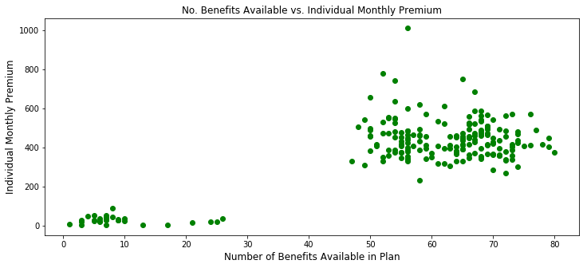
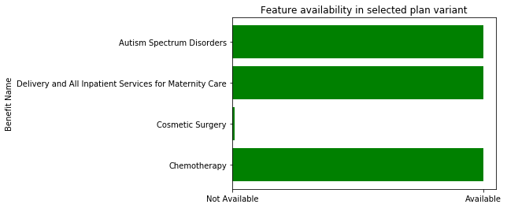

# Technical Report: Health Insurance Plan Recommender System

This technical report provides a sequential summary of the technical steps taken to process, explore, define, analyze, and draw conclusions from my data. In it, I outline the core tactics, methodologies, and libraries used in this project.

## Data from CMS via Kaggle

The Centers for Medicare & Medicaid Services (CMS) Center for Consumer Information & Insurance
Oversight (CCIIO) publishes "Exchange Public Use Files", or "PUFs", in order to improve transparency and increase access to data on Qualified Health Plans (QHPs) and Stand-alone Dental Plans (SADPs) offered through the Affordable Care Act's Health Exchanges.

A Kaggle-hosted data exploration prompt, [Health Insurance Marketplace](https://www.kaggle.com/hhs/health-insurance-marketplace), processed the CMS data to facilitate analytics. The processing script is available on [this GitHub repo.](https://github.com/benhamner/health-insurance-marketplace/blob/master/src/process.py)

I was provided with these six CSV files. I've used 3 of them in my analysis (in **bold**):

- **BenefitsCostSharing.csv** -- contains plan-level data on essential health benefits and coverage limits. [Used to derive benefit names].
- BusinessRules.csv -- plan-level data on rating business rules, such as allowed relationships (e.g., spouse, dependents) and tobacco use.
- Network.csv -- identifies provider network URLs.
- **PlanAttributes.csv** -- plan-level data on maximum out of pocket payments, deductibles, HSA eligibility, formulary ID, and other plan attributes.
- **Rate.csv** -- plan-level data on individual rates based on an eligible subscriber’s age, tobacco use, and geographic location, and family-tier rates.
- ServiceArea.csv -- issuer-level data on geographic service areas including state, county, and zip code

These PUFs do not include data from the 11 states that have their own State-Based Exchanges, which do not rely on the federal platform for QHP eligibility and enrollment functionality. These states are:

    1. California
    2. Colorado
    3. Connecticut
    4. Idaho
    5. Maryland
    6. Massachusetts
    7. Minnesota
    8. New York
    9. Rhode Island
    10. Vermont
    11. Washington

However, state-level PUFs are available data are available from a separate CMS portal, here: [https://www.cms.gov/CCIIO/Resources/Data-Resources/sbm-puf.html](https://www.cms.gov/CCIIO/Resources/Data-Resources/sbm-puf.html).

## Project Outline

### Background

Purchasing a health insurance plan can be a complicated thing to navigate. Many people skip purchasing health insurance due to a number of factors, often cited as a combination of insurance being:
- too expensive
- too limited in what's covered
- too complex

The ACA attempted to fix this problem by requiring consumers of healthcare to purchase insurance, or pay a fine. The ACA was successful in reducing the cost of healthcare for low-income consumers, and addressed some of the complexities of purchasing insurance by making insurance available through federal and state exchanges, but did not do enough to help consumers understand what they're getting in their insurance plan. It still remains opaque and somewhat complex.

### The Problem

When consumers of health insurance feel overwhelmed by choices and information, they can experience information overload and avoid making a choice as a result. Worse yet, without appropriate support through the process of choosing an insurance plan, many people could wind up with a plan that does not meet their needs and become saddled with bills as a result.  

When consumers choose an insurance plan, they need to be able to weigh trade-offs between cost and coverage for insurance features. Picking a plan that provides the coverage needed at an affordable priceis a difficult task. It is especially difficult when you don’t have a great understanding of the language that insurers use to describe plans.

### An Approach

The Centers for Medicaid and Medicare Services (CMS) provide data on health and dental plans offered to individuals and small businesses through the US Health Insurance Marketplace. This data contains all the various health plans offered on the Health Insurance Exchanges in the 50 states, including the cost for each plan and the benefits covered in those plans.

Using this data, we can build a system in which consumers can select the features they want in a health insurance plan and be presented a list of plans with their requested features and the price of the plan. We can evaluate the accuracy of our model by evaluating the mathematical distance (cosine similarity) between the features selected and the plans returned. Additionally, we can evaluate whether the benefits selected by the user are present in the list of plans presented to them, like so:

Using a recommendation engine such as this, consumers can select the benefits they want (examples: weight loss programs, chiropractic care, imaging, etc.) and be shown plans relevant to their health and be able to make better decision when purchasing insurance. A nimble, easy to navigate plan customization may also result in more uninsured people to purchase health insurance.

### Data

Using data from CMS and formatted and compiled by Kaggle (https://www.kaggle.com/hhs/health-insurance-marketplace/home), I have performed analysis and have built a recommender system.

The data, in various CSV files, totals 3.4GB on disk. However, through various methods including some NumPy and Pandas manipulations, I have managed to compress the data when loaded, which was uploaded to a PostgreSQL server on AWS for querying. The raw data has close to 800 different benefits, some of which have been combined under single categories based on domain knowledge.

## Directory Outline

In this repository, you will not be able run notebooks 1 through 4 as the data referenced in those notebooks is not uploaded to this GitHub repository. However, notebook 5, the actual recommender system, can be run as it is connected an AWS instance in which my necessary data is stored, on a PostgreSQL server.

* *[assets](notebooks)*

> certain images rendered this and other markdown files.

* *[notebooks](notebooks)*

> Mostly Jupyter notebooks, which make up the bulk of this project.

* *[pickles](notebooks)*

> Where my serialized (aka "pickled") data, such as small dataframes and lists, is stored. Pickles are created my from my various notebooks, and each pickle can be loaded into any other notebook for reference.

* *README.md*

> This file.