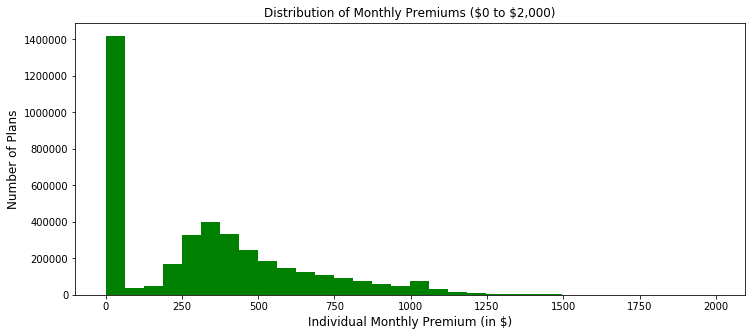
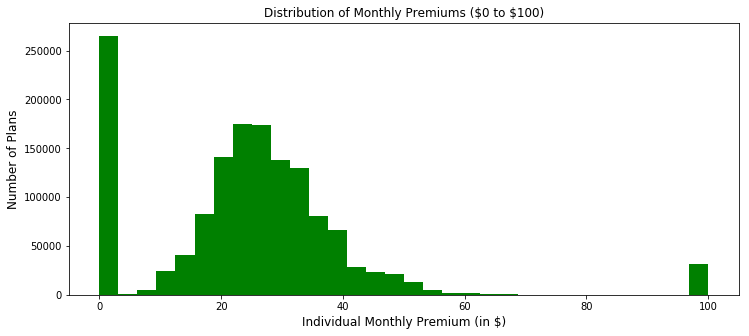
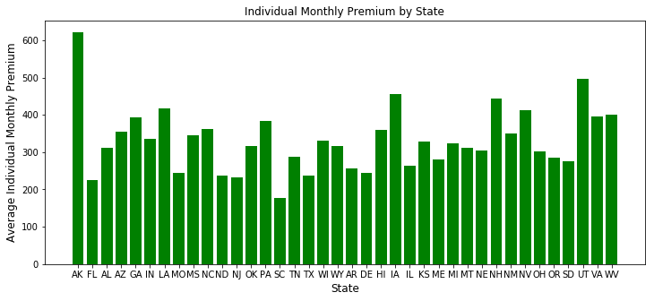
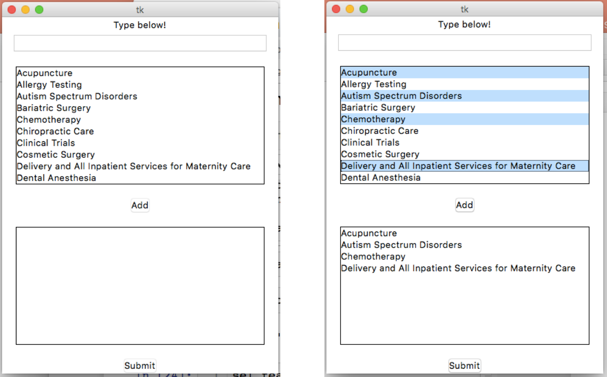
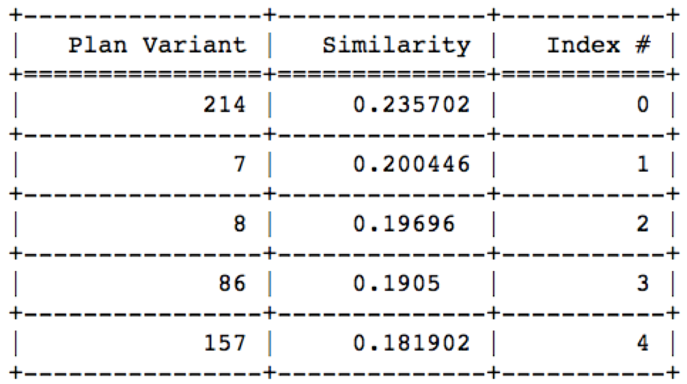
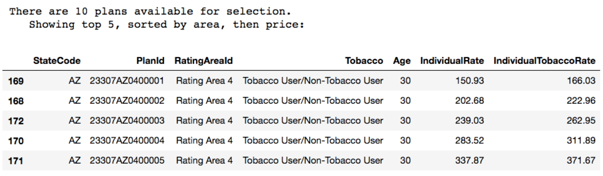

# Technical Report: Health Insurance Plan Recommender System

This technical report provides a sequential summary of the technical steps taken to process, explore, define, analyze, and draw conclusions from my data. In it, I outline the core tactics, methodologies, and libraries used in this project.

Note: notebooks \#1-4 cannot be run as they rely on certain pkl files that are not available in this GitHub repository.

## Data from CMS via Kaggle

The Centers for Medicare & Medicaid Services (CMS) Center for Consumer Information & Insurance
Oversight (CCIIO) publishes "Exchange Public Use Files", or "PUFs", in order to improve transparency and increase access to data on Qualified Health Plans (QHPs) and Stand-alone Dental Plans (SADPs) offered through the Affordable Care Act's Health Exchanges.

A Kaggle-hosted data exploration prompt, [Health Insurance Marketplace](https://www.kaggle.com/hhs/health-insurance-marketplace), processed the CMS data to facilitate analytics. The processing script is available on [this GitHub repo.](https://github.com/benhamner/health-insurance-marketplace/blob/master/src/process.py)

I was provided with these six CSV files. I've used 3 of them in my analysis (in **bold**):

| PUF CSV                     | Description                                                                                                                             |
|-----------------------------|-----------------------------------------------------------------------------------------------------------------------------------------|
| **BenefitsCostSharing.csv** | contains plan-level data on essential health benefits and coverage limits. Used to derive benefit names in analysis                    |
| BusinessRules.csv           | plan-level data on rating business rules, such as allowed relationships (e.g., spouse, dependents) and tobacco use                     |
| Network.csv                 | identifies provider network URLs.                                                                                                       |
| **PlanAttributes.csv**      |  plan-level data on maximum out of pocket payments, deductibles, HSA eligibility, formulary ID, and other plan attributes              |
| **Rate.csv**                | plan-level data on individual rates based on an eligible subscriber’s age, tobacco use, and geographic location, and family-tier rates |
| ServiceArea.csv             | issuer-level data on geographic service areas including state, county, and zip code                                                     |

These PUFs do not include data from the 11 states that have their own State-Based Exchanges, which do not rely on the federal platform for QHP eligibility and enrollment functionality. These states are:

    1. California
    2. Colorado
    3. Connecticut
    4. Idaho
    5. Maryland
    6. Massachusetts
    7. Minnesota
    8. New York
    9. Rhode Island
    10. Vermont
    11. Washington

However, state-level PUFs are available from a separate CMS portal, here: [https://www.cms.gov/CCIIO/Resources/Data-Resources/sbm-puf.html](https://www.cms.gov/CCIIO/Resources/Data-Resources/sbm-puf.html).

## Pre-processing

Two of the CSV files, `Rate.csv` and `BenefitsCostSharing.csv`, are very large in size when loaded into Pandas, at 9.3GB and 6.9GB each! The file sizes would have made it very difficult to perform manipulations or conduct analysis on the data:

    - `Rate.csv`: 12,700,000 rows x 24 cols (9.3GB)
    - `BenefitsCostSharing.csv` - 5,000,000 rows x 32 cols (6.9GB)

### Object vs. category columns

The cause for this was the numerous "object" columns present in my data. As a corollary, to reduce memory usage, most object columns whose unique values comprise _less than 50% of the total values in the column_, can be casted as "category" type columns.

A "category casting" hashes the values in the column, thus compressing the data. In an "object" column each value in the column is stored individually in memory. However, in a "category" column, each unique value is hashed, and instead simply points to the value's _location_ in memory, dramatically reducing memory requirements.

So, a column of 5 million "Yes's" and "No's" (5 million strings) can be hashed into only **two** values in memory, thus significantly compressing the size of that column.

After casting the object columns as categories, I pickled the dataframes to be used in the next notebook.

## Cleaning the benefits and rate data

After pre-processing `benefits` and `rate` and compressing them down to workable sizes, I dropped rows corresponding to historical past years, as we want to analyze the most current year available, 2016. I also dropped some plan variants whose only difference is the amount of subsidy received by the applicant (however, the premium remains the same). In addition, I dropped certain un-needed columns and cleaned the text.

### Crosswalk

The benefits dataframe has, as you might expect, a column called 'BenefitName', which contains each benefit offered in each health insurance plan. Many of the benefits in the column are the same but differ due to misspellings or containing extraneous characters.

I created a crosswalk CSV in which I mapped 'BenefitName' variants to a single name. For example, these three benefits:

    - Cosmetic Orthodontia-Child
    - Cosmetic Orthodontics - Child
    - Cosmetic Orthodontics-Child

Were collapsed into one, renamed benefit:

    - Orthodontia, Cosmetic - Child

### One-hot encoding benefits

After mapping plan names with my crosswalk, I one-hot encoded the benefits. To do this, I grouped by PlanIds and transformed all the benefits associated with each plan into _columns_ sitting beside the plans, filled with 1s and 0s based on coverage. This had the effect of reducing the number of rows, but increasing the number of columns in my data (data was made more square).

My resulting data was about 4 million rows by 232 columns in size, with each row corresponding to a unique plan, and columns corresponding to plan info, such as monthly premiums, and benefits data.

## Exploratory data analysis

Most of the exploration was done based on the distributions of premiums and analyzing the number of benefits available relative to the monthly premium. This is because low-cost plans often do not have many covered benefits, yet plans that offer many benefits are relatively costly, with a gap in mid-level coverage:

The below graphs show the distribution of monthly premiums from $0 to $2,000, and $0 to $100. There are peaks clearly visible, which could be interesting to analyze further.

The below graph shows the average premium in each available state (39 states). Most often, high costs in a given area can be explained by a relative lack of competition in the area. This is also something interesting that can be explored further.

## Modeling

### Vectorizing and storing

By having my benefits one-hot encoded, I could now store the _unique_ combinations of benefits, and analyze them as unique vectors. I assigned a foreign key (which I called `'ben_key'`) to each unique combination (to be able to map back to the original plans), and then dropped all duplicate vectors, resulting in a matrix of unique vectors, called `no_dupes` (215 rows of unique benefit combinations x 207 columns of unique benefits).

I then decided to add my final list of plans to a Postgres server on an AWS EC2 instance so as to make the data accessible for querying if put into a production or production-like environment. I did not include my one-hot encoded benefits on the server, since I already turned them into unique vectors, and mapped them with my foreign key called `'ben_key'`.

The querying time for the data on my server (4,000,000 rows x 25 columns) is just under one second.

### User input

First, the user can run a function to filter the plans available on the Postgres server by State, Age, and Tobacco Use. This returns a dataframe of benefits matching that filter. Based on the filtering criteria applied, a list of available corresponding benefits is stored as a list that the user can select from.

Using a library called `tkinter`, which is the standard Python interface to the Tk GUI toolkit, I ask users to select from the list of benefits mentioned above:

### Recommendations

A vector is created based on the benefits selected by the user and is compared against my `no_dupes` matrix. I perform a calculation called `cosine similarity`, using the scikit-learn cosine similarity library, which calculates the mathematical distance between two vectors. Based on such similarity, a list of matching plan types are shown:

The user can then view all the plans available in the plan type selected. Individual plans in a given plan type chiefly vary by the geographic area in which the plan is offered, which CMS has defined for each state as part of the legislation passed in the Affordable Care Act.

### Evaluation

We can evaluate whether the benefits selected by the user are present in the list of plans presented to them, like so:

Using a recommendation engine such as this, consumers can select the benefits they want (examples: weight loss programs, chiropractic care, imaging, etc.) and be shown plans relevant to their health and be able to make better decisions when purchasing insurance. A nimble, easy to navigate plan customization may also result in more uninsured people purchasing health insurance.

## Future Steps

**Add coarser layers of resolution** - though the recommendation system performs quite well with regards to finding plans that have the benefits you seek, it may be too granular of a selection criteria. A future attempt to create bigger buckets / categories that correspond to various plan groupings would help users make more generalized choices, but which would come at the expense of more generalized matches.

**Conduct additional analysis on premiums** - perform a regression analysis that can identify the specific benefits that are the greatest contributors to cost in a given plan, and provide such proprietary information to the user.

**Links to actual plans** - give users a way to view the Summary of Benefits and Coverage for any given plan presented, which is a summary form explaining the plan's benefits and costs, [available here](https://www.cms.gov/CCIIO/Resources/Files/Downloads/sbc-sample.pdf).

**Add additional filters** - each state is divided in rating areas based on CMS rules, which correspond to various ZIP codes within each state. This project did not include a ZIP code filter, which limits the overall "accuracy" of plans recommended by the engine, but users can be cautioned to select a plan that corresponds with their selected region. A future iteration of this project might include a ZIP code filter that maps to each plan's Rating Areas.